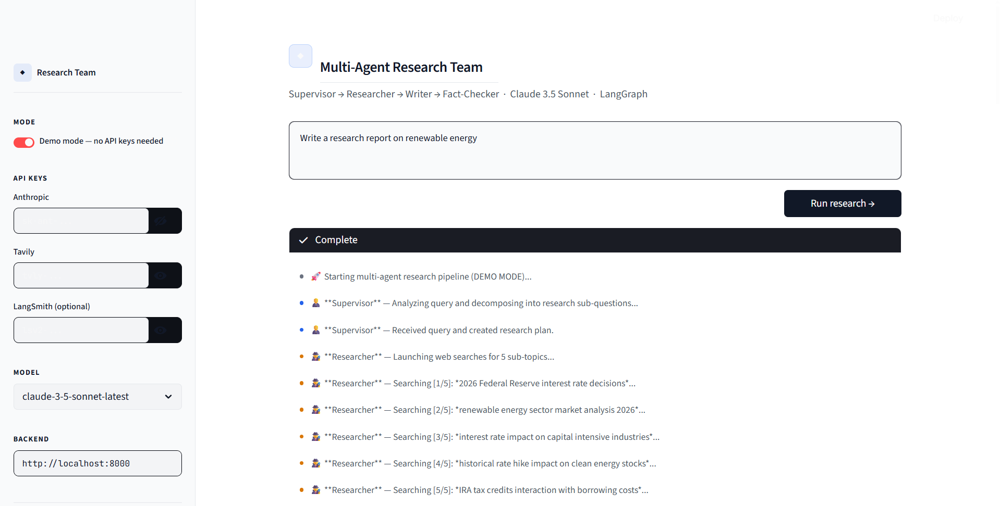
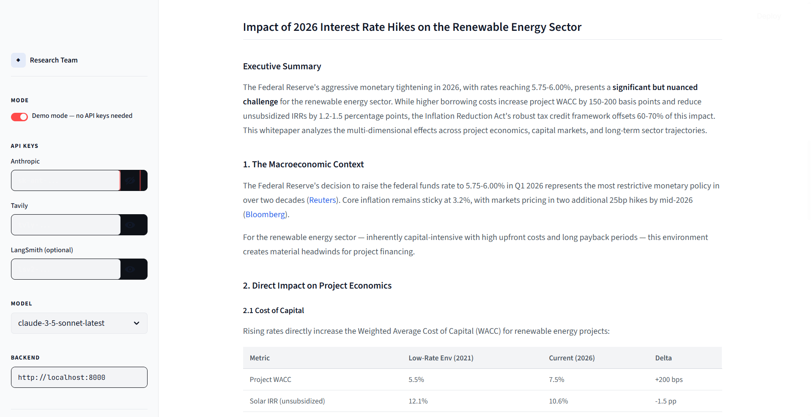
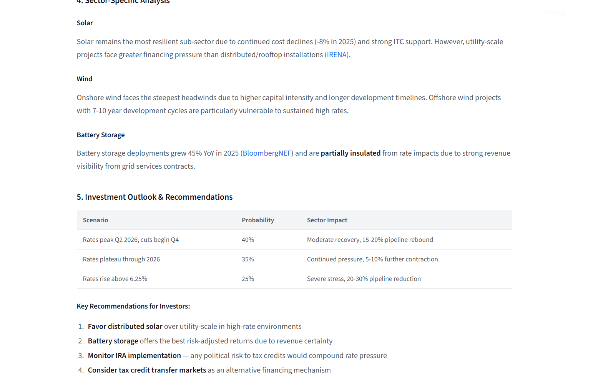

# Multi-Agent AI Research Team 🧠

A full-stack, professional AI orchestration project that demonstrates autonomous agents reasoning, critiquing, and self-correcting to produce high-quality research reports.

This project moves beyond simple "input-output" prompting. It uses **LangGraph** to orchestrate a team of agents (Supervisor, Researcher, Writer, Fact-Checker) in a cyclic graph workflow.





## Features

- **Multi-Agent Orchestration**: Powered by LangGraph for cyclical workflows (e.g. Writer ↔ Fact-Checker revision loop).
- **FastAPI Backend**: Robust API with Server-Sent Events (SSE) streaming for real-time UI updates.
- **Streamlit Frontend**: A sleek, professional dark/light theme dashboard built for a seamless user experience.
- **Built-in Demo Mode**: Run the entire pipeline with simulated realistic delays and responses—**no API keys required**! Perfect for demonstrations and testing.
- **PDF Export**: Automatically generates a cleanly formatted PDF of the final research whitepaper.

## The Agent Team

1. **Supervisor**: Analyzes the user's query and delegates specific research tasks.
2. **Researcher**: Uses Tavily AI to perform iterative web searches and gather facts.
3. **Writer**: Synthesizes the research into a structured, professional Markdown report.
4. **Fact-Checker**: Reviews the Writer's draft against the research. If confidence is below 70%, it sends critiques back to the Writer for a mandatory revision.

## Tech Stack

- **Orchestration**: `langgraph`, `langchain`
- **LLM Engine**: Claude 3.5 Sonnet (`langchain-anthropic`)
- **Search Engine**: Tavily AI (`tavily-python`)
- **Backend**: `fastapi`, `uvicorn`, `sse-starlette`
- **Frontend**: `streamlit`, `sseclient-py`
- **Document Generation**: `fpdf2`

## Quickstart (Demo Mode)

The quickest way to see the project in action is using **Demo Mode**. It simulates the entire pipeline locally without requiring any paid API keys.

1. **Clone the repository**
   ```bash
   git clone https://github.com/manpatell/Multi-Agent-Research-Team.git
   cd Multi-Agent-Research-Team
   ```

2. **Install dependencies**
   ```bash
   pip install -r requirements.txt
   ```

3. **Start the FastAPI Backend**
   Open a terminal and run:
   ```bash
   uvicorn backend.main:app --reload --port 8000
   ```

4. **Start the Streamlit Frontend**
   Open a second terminal and run:
   ```bash
   streamlit run frontend/app.py
   ```

5. **Run the Demo**
   Navigate to `http://localhost:8501`. Ensure the "Demo Mode" toggle is **ON** in the sidebar, type any query, and click "Run research".

## Running with Real API Keys

To use real AI models (Claude 3.5 Sonnet) and perform actual live web searches:

1. Create a `.env` file in the root directory (or copy `.env.example`).
2. Add your API keys to the `.env` file, or enter them directly into the Streamlit sidebar:
   ```env
   ANTHROPIC_API_KEY=sk-ant-...
   TAVILY_API_KEY=tvly-...
   ```
3. Turn **OFF** the "Demo Mode" toggle in the Streamlit UI and execute your query.

## Architecture

```
User Query → [ FastAPI (SSE Stream) ] → [ LangGraph StateGraph ]
                                                   ↓
                                            (1) Supervisor
                                                   ↓
                                            (2) Researcher (Tavily Search)
                                                   ↓
                    ┌────────────────────── (3) Writer 
                    ↑                              ↓
              (Revision Loop)               (4) Fact-Checker
                    ↑                              ↓ (If score < 70)
                    └──────────────────────────────┘
                                                   ↓ (If score >= 70)
                                            Final Report
```

## License

MIT License
